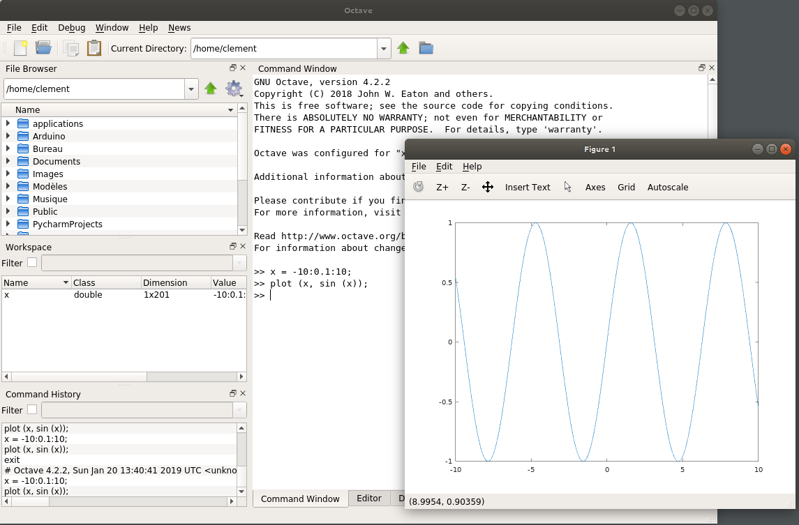

:toc:

ifdef::env-github[]
image:https://github.com/kalemena/docker-octave/workflows/Pipeline/badge.svg[GitHub Build]
image:https://img.shields.io/docker/v/kalemena/octave[Docker Hub, link=https://hub.docker.com/r/kalemena/octave/tags]
image:https://img.shields.io/docker/pulls/kalemena/octave[Docker Hub, link=https://hub.docker.com/r/kalemena/octave/tags]
image:https://img.shields.io/docker/image-size/kalemena/octave[Docker Hub, link=https://hub.docker.com/r/kalemena/octave/tags]
endif::[]

Octave in docker with UI.

# How-To

## Build

This will create kalemena/octave:latest image

[source,bash]
----
$ make build
----

## Run

This will start the Octave UI, with redirecting display to current user display.

[source,bash]
----
$ make start
----

## UI example

In Octave UI, you can try plot to check UI is fully working:

[source,bash]
----
>> x = -10:0.1:10;
>> plot (x, sin (x));
----

